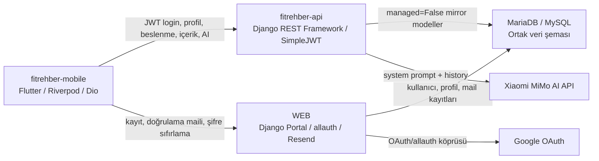

# FitRehber Mobil

FitRehber Mobil, Flutter ile geliştirilmiş; beslenme takibi, kişisel hedef hesaplama,
sağlık içerikleri, forum, profil yönetimi ve yapay zeka asistanı özelliklerini tek
uygulamada birleştiren kapsamlı bir fitness rehberi uygulamasıdır.

Bu repo yalnızca bir mobil arayüz değildir. Uygulama, WEB projesinin sahip olduğu
e-posta doğrulama ve şifre sıfırlama akışlarıyla, `fitrehber-api` projesinin sunduğu
JWT tabanlı mobil API katmanıyla birlikte çalışan üç parçalı bir sistemin mobil
istemcisidir.

## İçindekiler

- [Öne Çıkanlar](#öne-çıkanlar)
- [Sistem Mimarisi](#sistem-mimarisi)
- [Temel Akışlar](#temel-akışlar)
- [Kullanılan Teknolojiler](#kullanılan-teknolojiler)
- [Proje Yapısı](#proje-yapısı)
- [Kod Rehberi](#kod-rehberi)
- [Canlı Revize Haritası](#canlı-revize-haritası)
- [Kurulum](#kurulum)
- [Test ve Doğrulama](#test-ve-doğrulama)
- [Savunma Notları](#savunma-notları)

## Öne Çıkanlar

| Alan | Açıklama |
| --- | --- |
| Kimlik doğrulama | E-posta/parola, Google OAuth 2.0 + PKCE, JWT access/refresh token, güvenli token saklama. |
| E-posta doğrulama | Mobil kayıt WEB projesindeki `/mobile/auth/register/` endpointine gider; kullanıcı inactive açılır ve doğrulama maili gönderilir. |
| Şifre sıfırlama | Mobil uygulama reset talebini WEB endpointine iletir; reset linki mevcut güvenli web reset sayfasına gider. |
| Oturum yönetimi | Riverpod tabanlı `OturumDenetleyici`, token/profil/ilk kurulum durumuna göre uygulama yönünü belirler. |
| Backend entegrasyonu | Dio tabanlı `ApiServisi`, token ekleme, 401 sonrası refresh ve kullanıcı dostu hata yönetimini merkezi olarak yürütür. |
| Beslenme takibi | Günlük kalori, makro ve su hedefleri; Mifflin-St Jeor + sabit aktivite çarpanı ile hesaplanır. |
| İçerik çizimi | Backend zengin HTML içeriği mobil-native `yazi_mobil_bloklar` formatına dönüştürülür ve Flutter widgetlarıyla çizilir. |
| AI asistan | Mobil `/api/ai/chat/` endpointine gider; API kullanıcı profil/veri bağlamını system prompta ekleyip MiMo modelinden cevap alır. |
| Offline deneyim | Ana sayfa içerikleri yerel önbellekten hızlı açılır, ağ yoksa kullanıcı boş ekranla bırakılmaz. |
| Kod okunabilirliği | Uygulamaya ait sınıf/dosya/değişken isimleri Türkçeleştirilmiş, framework ve backend kontratları korunmuştur. |

## Sistem Mimarisi

Bu proje üç ana sistemle birlikte çalışır:



Detaylı ve etkileşimli mimari diyagram repo içinde yer alır:

[docs/sistem_mimarisi.html](docs/sistem_mimarisi.html)

Bu HTML dosyası sunum için hazırlanmış bir blueprinttir. Mobil, WEB, API, veritabanı
ve dış servisleri ayrı katmanlarda gösterir. GitHub üzerinde kaynak olarak görünür;
görsel/etkileşimli hali için dosya tarayıcıda açılabilir.

## Temel Akışlar

### 1. Login / JWT

```text
GirisEkrani
-> OturumDenetleyici.girisYap
-> KimlikServisi.girisYap
-> POST https://api.fitrehber.com.tr/api/auth/login/
-> access + refresh + kullanici
-> FlutterSecureStorage
-> profil yükleme
-> router yönlendirmesi
```

Yanlış parola veya bilinmeyen kullanıcı `401` döner. Şifresi doğru ama e-postası
doğrulanmamış inactive kullanıcı `403 email_verification_required` alır ve mobil
e-posta doğrulama ekranına yönlendirilir.

### 2. Kayıt / E-posta Doğrulama

```text
KayitEkrani
-> KimlikServisi.kayitOl
-> POST https://fitrehber.com.tr/mobile/auth/register/
-> WEB KullaniciKayitFormu validasyonu
-> user.is_active = False
-> EmailAddress.send_confirmation(...)
-> Resend / BrowserConsole backend
-> EpostaDogrulamaEkrani
```

Bu akış özellikle WEB projesinin sahipliğinde bırakılmıştır. Çünkü e-posta doğrulama,
allauth ve şifre sıfırlama linkleri WEB tarafındaki güvenli akışlarla yönetilir.

### 3. Normal API İsteği

```text
Ekran
-> Provider / Denetleyici
-> ApiServisi
-> Authorization: Bearer <access>
-> fitrehber-api DRF view
-> JSON model dönüşümü
-> Riverpod state update
-> Flutter rebuild
```

Access token süresi dolarsa `ApiServisi` 401 yanıtını yakalar, `KimlikServisi`
üzerinden refresh token ile yeni access token alır ve isteği bir kez daha dener.

### 4. Beslenme Hedefi

```text
ProfilModel
-> BeslenmeHesaplayici.calculate(...)
-> BMR / TDEE
-> hedefe göre -300 / +300 / nötr
-> makro dağılımı
-> su hedefi
-> Beslenme ekranı
```

Formüller UI içinde dağınık değildir; `lib/shared/utils/beslenme_hesaplayici.dart`
dosyasında merkezi tutulur ve testlerle korunur.

### 5. Google OAuth + PKCE

```text
Mobil state + code_verifier üretir
-> WEB /accounts/mobile-google/start/
-> Google/allauth doğrulaması
-> WEB MobileOAuthCode üretir
-> fitrehber://oauth/callback veya web callback
-> API /api/auth/google/token/
-> state + code_verifier kontrolü
-> JWT üretimi
```

PKCE kullanılır çünkü mobil uygulama içinde `client_secret` güvenli biçimde
saklanamaz. `state` değeri ise CSRF ve sahte callback riskine karşı kullanılır.

## Kullanılan Teknolojiler

| Teknoloji | Rol |
| --- | --- |
| Flutter / Dart | Mobil uygulama geliştirme |
| Riverpod | State management |
| go_router | Route ve auth guard yönetimi |
| Dio | HTTP istemcisi, interceptor, retry |
| flutter_secure_storage | Access/refresh token saklama |
| shared_preferences | İçerik/kategori önbelleği ve kullanıcı tercihleri |
| cached_network_image | Ağ görselleri için cache destekli görüntüleme |
| app_links / url_launcher | Google OAuth deep link ve dış tarayıcı akışı |
| flutter_markdown | AI asistan mesajlarının markdown çizimi |

## Proje Yapısı

Proje feature-first klasör düzeni kullanır. Uygulamaya ait dosya, sınıf ve değişken
isimleri Türkçe tutulmuştur.

```text
lib/
  main.dart
  core/
    constants/api_sabitleri.dart
    router/uygulama_yonlendirici.dart
    theme/uygulama_temasi.dart
  features/
    kimlik/
      giris_ekrani.dart
      kayit_ekrani.dart
      eposta_dogrulama_ekrani.dart
      sifremi_unuttum_ekrani.dart
    ilk_kurulum/
      ilk_kurulum_ekrani.dart
    ana_sayfa/
    beslenme/
      providers/beslenme_provider.dart
      widgets/
    icerik/
      widgets/icerik_blok_cizici.dart
    forum/
    asistan/
      providers/asistan_provider.dart
    profil/
      providers/profil_provider.dart
      widgets/profil_duzenleme_paneli.dart
    kategoriler/
    arama/
  shared/
    api_servisi.dart
    kimlik_servisi.dart
    oturum_denetleyici.dart
    google_oauth_akisi.dart
    hata_yardimcilari.dart
    models/
    utils/beslenme_hesaplayici.dart
    services/yerel_besin_veritabani.dart
    widgets/
docs/
  sistem_mimarisi.html
test/
  api_sabitleri_test.dart
  ...
```

## Kod Rehberi

Kod tabanı savunmada rahat okunabilmesi için Türkçe semantik isimlendirmeye
yaklaştırılmıştır. Ancak üç sınır bilinçli olarak korunmuştur:

1. Flutter/Dart framework API isimleri:
   `build`, `initState`, `dispose`, `fromJson`, `toJson`, `copyWith`, `Widget`,
   `TextEditingController`.

2. Backend JSON kontratı:
   `username`, `email`, `password`, `access`, `refresh`, `is_onboarded`,
   `message`, `history`, `answer`.

3. Endpoint pathleri:
   `/auth/login/`, `/mobile/auth/register/`, `/auth/google/token/`,
   `/auth/token/refresh/`.

Bu ayrımın sebebi şudur: Kod içi isimler mobil uygulamanın kontrolündedir, fakat
JSON keyleri ve URL pathleri backend sözleşmesidir. Mobil taraf bunları tek başına
Türkçeleştirirse API kontratı bozulur.

Önemli merkez dosyalar:

| Dosya | Görev |
| --- | --- |
| `lib/core/constants/api_sabitleri.dart` | Tüm backend endpointlerinin merkezi adres defteri. |
| `lib/shared/kimlik_servisi.dart` | Login, kayıt, refresh, Google token exchange, secure storage. |
| `lib/shared/api_servisi.dart` | Profil, içerik, beslenme, yorum ve AI API çağrıları. |
| `lib/shared/oturum_denetleyici.dart` | Oturum state, profil yükleme, offline durumda token koruma. |
| `lib/core/router/uygulama_yonlendirici.dart` | Auth, ilk kurulum ve ana uygulama yönlendirme öncelikleri. |
| `lib/shared/google_oauth_akisi.dart` | OAuth 2.0 + PKCE state/code_verifier/code_challenge üretimi. |
| `lib/shared/utils/beslenme_hesaplayici.dart` | Kalori, makro ve su hedefi formülleri. |
| `lib/features/icerik/widgets/icerik_blok_cizici.dart` | Mobil-native içerik bloklarının çizimi. |

## Canlı Revize Haritası

Savunma sırasında bir değişiklik istenirse önce katman belirlenir:

| Hoca isteği | Bakılacak yer | Dikkat edilecek sınır |
| --- | --- | --- |
| Buton yazısı/rengi değişsin | İlgili `features/..._ekrani.dart` veya `uygulama_temasi.dart` | Sadece UI değişir. |
| Giriş hata mesajı değişsin | `kimlik_servisi.dart`, `hata_yardimcilari.dart` | Backend status code değişmez. |
| Yeni endpoint eklensin | `api_sabitleri.dart`, `api_servisi.dart` | Endpoint path backendle aynı kalmalı. |
| Profil alanı eklensin | `profil_model.dart`, ilk kurulum, profil düzenleme paneli | JSON key backend kontratıdır. |
| İlk kurulum adımı değişsin | `ilk_kurulum_ekrani.dart` | Adım sayısı, validasyon ve gönderilen JSON birlikte düşünülür. |
| Beslenme formülü değişsin | `beslenme_hesaplayici.dart` | Testte beklenen değerler güncellenir. |
| Login sonrası yön değişsin | `uygulama_yonlendirici.dart`, `oturum_denetleyici.dart` | Auth/onboarding öncelik sırası bozulmaz. |
| AI mesaj formatı değişsin | `asistan_provider.dart`, `api_servisi.dart` | `message/history/answer` API kontratı korunur. |

Canlıda güvenli değişiklikler: metin, renk, küçük validasyon eşiği, lokal UI düzeni.

Canlıda dikkatli yapılacaklar: route değişikliği, profil alanı, onboarding akışı,
provider invalidation.

Canlıda girilmemesi gerekenler: token storage keylerini değiştirme, OAuth redirect
URI değiştirme, JSON keylerini keyfi Türkçeleştirme, Riverpod yerine başka state
yönetimine geçme.

## Kurulum

Flutter SDK kurulu olmalıdır.

```bash
flutter pub get
flutter run
```

WEB build/ön test için:

```bash
flutter run -d chrome
```

## Test ve Doğrulama

```bash
dart format lib test
flutter analyze
flutter test
```

Endpoint regresyon kontrolü:

```bash
flutter test test/api_sabitleri_test.dart
```

Bu test özellikle şu hataları engeller:

```text
/auth/login/               -> /auth/giris/ olmamalı
/mobile/auth/register/     -> /mobile/auth/kayit/ olmamalı
/auth/token/refresh/       -> değişmemeli
/auth/google/token/        -> değişmemeli
/profil/onboard/           -> ilk kurulum kontratı korunmalı
```

Son doğrulama durumunda analiz temiz ve test paketi başarılıdır.

## Savunma Notları

Kısa proje anlatımı:

> FitRehber Mobil, Flutter/Riverpod ile geliştirilmiş bir fitness rehberi
> uygulamasıdır. Mobil taraf kullanıcı arayüzü, state yönetimi ve yerel hesaplama
> katmanını üstlenir. Kayıt, e-posta doğrulama ve şifre sıfırlama WEB projesinin
> sahipliğindedir. JWT login, profil, beslenme, içerik, yorum ve AI akışları ise
> fitrehber-api üzerinden yürür. Endpoint ve JSON alanları backend kontratı olduğu
> için korunmuş, uygulama içi isimler savunmada okunabilirlik için Türkçeleştirilmiştir.

Hoca sorarsa:

| Soru | Kısa cevap |
| --- | --- |
| Neden endpointler İngilizce kaldı? | Çünkü endpoint pathleri backend sözleşmesidir. Mobil tek başına değiştiremez. |
| Neden JSON keyleri Türkçeleştirilmedi? | `fromJson` ve backend response kontratı bozulmasın diye. |
| Token nerede saklanıyor? | `flutter_secure_storage` içinde, `KimlikServisi` üzerinden. |
| Access token bitince ne oluyor? | `ApiServisi` 401 yanıtında refresh dener ve isteği bir kez tekrarlar. |
| İnternet yokken neden çıkış yapılmıyor? | Ağ hatası auth hatası değildir; oturum ve varsa cached profil korunur. |
| PKCE neden var? | Mobil uygulamada client secret saklanamayacağı için OAuth güvenliği PKCE ile sağlanır. |
| Beslenme hedefi nasıl hesaplanıyor? | Profil verisi `BeslenmeHesaplayici` içine girer; Mifflin-St Jeor + hedef düzeltmesi uygulanır. |
